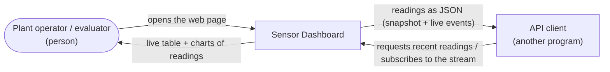
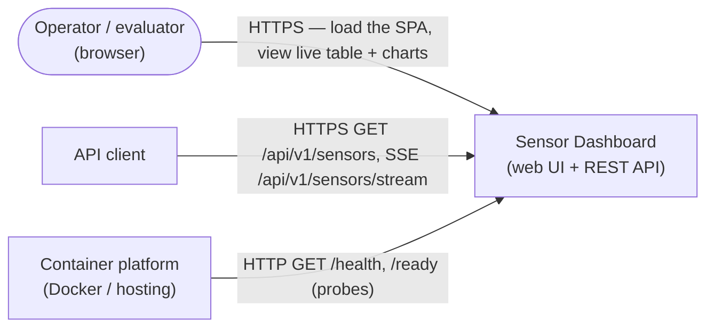

# 3. Context and Scope

This chapter draws the boundary around the system: who and what it exchanges
data with, and what is in and out of scope. It treats the system as a single
black box — how that box is divided into services comes later
([Chapter 5](05-building-block-view.md)).

## 3.1 Business context

The business context shows who uses Sensor Dashboard and what they exchange with
it. A person watches the readings on a web page; another program can read them
over the API. The system produces its own sensor data through a built-in
simulator, so it depends on no upstream data provider.

| Communication partner | Input | Output |
|-----------------------|-------|--------|
| Plant operator / evaluator (person, via the web page) | Opens the dashboard in a browser | A live table of recent readings and an embedded chart view |
| API client (another program, via the API) | Requests recent readings, optionally bounded; or subscribes to the live stream | Readings as JSON — a snapshot array, or a stream of live events |

## 3.2 Technical context

The technical context shows the runtime channels that connect the system to its
environment, and which data travels over each. Build and deployment are out of
scope here ([Chapter 7](07-deployment-view.md)).

| Channel | Protocol | Notes |
|---------|----------|-------|
| Web page | HTTP/1.1, browser | Serves the single-page application; client-side routes fall back to the app shell. |
| REST API | HTTP `GET /api/v1/sensors` | Returns the most recent readings as a JSON array, newest first, bounded by an optional `?limit=` (1–100). |
| Live stream | HTTP `GET /api/v1/sensors/stream` (Server-Sent Events) | A long-lived `text/event-stream`: each newly recorded reading is pushed as a `data:` event, with periodic keep-alive comments. |
| Health / readiness | HTTP `GET /health`, `GET /ready` | Called by the platform's probes. `/health` is a shallow liveness check; `/ready` reports whether the database is reachable. No authentication. |

The web page and the API share one origin: the browser talks only to the
frontend, which serves the page and forwards `/api/` calls to the backend. TLS,
when present, is terminated by the platform's edge — the services themselves
speak plain HTTP.

## 3.3 Scope

**In scope**

- The functional requirements in [Chapter 1](01-introduction-and-goals.md)
  (§1.1, FR01–FR08): generation, storage, a versioned REST API, a bounded
  query, a live stream, a web table, charts, and health/readiness checks.
- Persisting readings in a relational database, with schema managed by
  migrations.
- A web page with explicit loading, empty, and error states.
- Deployable container images and a live demo deployment.
- An automated test suite and CI quality gates across both stacks.

**Out of scope**

- Real sensor hardware or an external data feed — readings are simulated.
- Authentication, authorization, and rate limiting.
- Editing, deleting, or acknowledging readings — the API is read-only over HTTP
  `GET`; only the simulator writes.
- Alerting, retention/archival policies, and long-term capacity planning.
