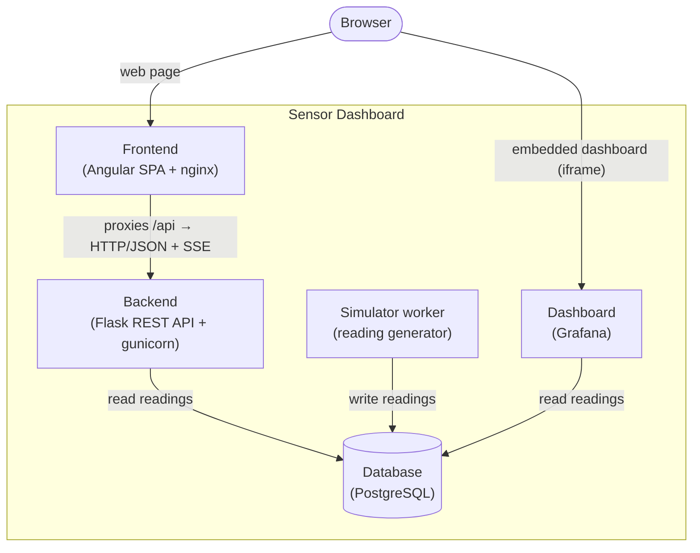
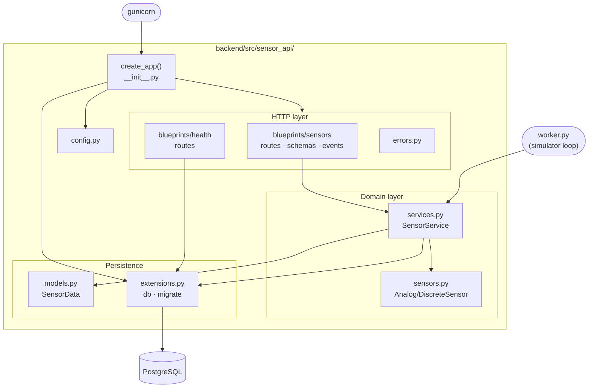
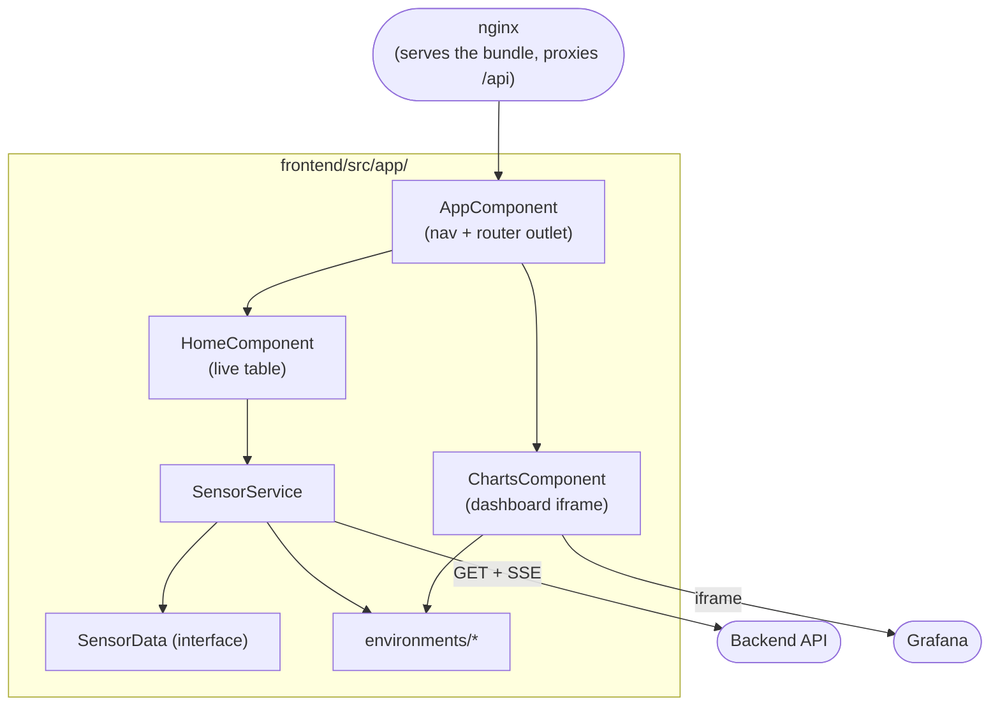

# 5. Building Block View

This chapter opens the black box from [Chapter 3](03-context-and-scope.md) and
shows the static decomposition of the system — first into its services, then
into the parts of the two services that hold code.

## 5.1 Level 1 — the services

The system is four services plus a background worker. The browser talks only to
the frontend, which serves the web page and forwards API calls to the backend.
The backend and the worker read and write the database. The dashboard reads the
same database and is embedded back into the web page.

| Building block | Responsibility |
| --- | --- |
| Frontend | Serves the single-page application and proxies `/api` calls to the backend on one origin; renders the live table and embeds the dashboard. |
| Backend | The REST API: validates requests, reads readings from the database, serves the snapshot and the live stream, and answers the health/readiness probes. |
| Simulator worker | Produces one reading per interval and writes it to the database. Runs as its own process, separate from the web server. |
| Database | PostgreSQL — the single system of record for readings. |
| Dashboard | Grafana — reads the database through a provisioned datasource and renders the charts, which the frontend embeds. |

Dependencies point toward the database: the frontend depends only on the
backend's HTTP contract; the backend and the worker depend on the database; the
dashboard depends on the database. Nothing depends on the frontend, which keeps
the browser-facing edge free to change without disturbing the core.

## 5.2 Level 2 — inside the backend

The backend is a Flask application assembled by an application factory. Its parts
divide into an HTTP layer that speaks to clients, a domain layer that holds the
logic, a persistence layer for the database, and a set of crosscutting parts
(config, errors) shared across the rest. The worker reuses the domain and
persistence layers without any of the HTTP layer.

| Subcomponent | Role |
| --- | --- |
| [`__init__.py`](../../backend/src/sensor_api/__init__.py) | The `create_app()` factory — wiring only: load config, initialize the extensions, register the blueprints, scope CORS to `/api/*`, and register the error handlers. It starts no threads and creates no schema. |
| [`config.py`](../../backend/src/sensor_api/config.py) | Three environment-driven config classes — `DevelopmentConfig`, `TestingConfig`, `ProductionConfig` — selected by `APP_CONFIG`; production has debug off. |
| [`extensions.py`](../../backend/src/sensor_api/extensions.py) | The shared extension instances: `db` (SQLAlchemy 2.x with a typed declarative base) and `migrate` (Alembic). |
| [`blueprints/sensors/routes.py`](../../backend/src/sensor_api/blueprints/sensors/routes.py) | The `/api/v1` blueprint: `GET /sensors` (bounded snapshot) and `GET /sensors/stream` (SSE). Handlers stay thin — parse, delegate, serialize. |
| [`blueprints/sensors/schemas.py`](../../backend/src/sensor_api/blueprints/sensors/schemas.py) | The boundary contract: `parse_limit()` enforces the 1–100 bound (400 on a bad value) and `serialize_reading()` turns a row into JSON with an ISO-8601 UTC timestamp. |
| [`blueprints/sensors/events.py`](../../backend/src/sensor_api/blueprints/sensors/events.py) | `sensor_event_stream()` — the generator behind the SSE endpoint: emits the latest reading, then polls for newer rows and yields each as an event. |
| [`blueprints/health/routes.py`](../../backend/src/sensor_api/blueprints/health/routes.py) | `GET /health` (shallow liveness) and `GET /ready` (deep readiness — runs `SELECT 1`, returns 503 if the database is unreachable). |
| [`services.py`](../../backend/src/sensor_api/blueprints/sensors/services.py) | `SensorService` — the domain logic: build the sensors, record a reading (commit-or-rollback), and read readings (`fetch_data` newest-first, `fetch_since` for the stream cursor). |
| [`sensors.py`](../../backend/src/sensor_api/sensors.py) | The simulator model: `AnalogSensor` (temperature, humidity) and `DiscreteSensor` (vibration) behind a common interface, each producing one reading on `read()`. |
| [`models.py`](../../backend/src/sensor_api/blueprints/sensors/models.py) | The `SensorData` ORM model — the `sensor_data` table, with an index on `timestamp`. |
| [`errors.py`](../../backend/src/sensor_api/errors.py) | The `BackendError` base exception and the handlers that turn exceptions into RFC 9457 problem+json responses. |
| [`worker.py`](../../backend/src/sensor_api/worker.py) | The simulator loop: build the sensors once, then record a reading every `SAMPLE_INTERVAL_SECONDS`, logging each insert and surviving failures. |

Dependencies flow inward: the HTTP layer depends on the domain and persistence
layers; the domain layer knows nothing about Flask, which lets the worker reuse
it directly.

## 5.3 Level 2 — inside the frontend

The frontend is an Angular single-page application of standalone components. A
shell component holds the navigation and a router outlet; two feature components
fill it — one for the live table, one for the charts. A single service owns all
talk to the backend, and a small set of environment files hold the URLs so
nothing is hardcoded.

| Subcomponent | Role |
| --- | --- |
| [`app.component.ts`](../../frontend/src/app/app.component.ts) | The shell: a header with the "Live Table" / "Charts" navigation and the router outlet. |
| [`app.routes.ts`](../../frontend/src/app/app.routes.ts) | Routes: `''` → the table, `charts` → the charts, and a wildcard redirect back to the table. |
| [`home/home.component.ts`](../../frontend/src/app/home/home.component.ts) | The live table: loads a snapshot in `ngOnInit`, then subscribes to the stream; renders explicit loading, empty, error, and live states; caps the visible rows. |
| [`charts/charts.component.ts`](../../frontend/src/app/charts/charts.component.ts) | Embeds the Grafana dashboard as an iframe when a dashboard URL is configured, or shows a "not configured" message when it is not. |
| [`sensors.service.ts`](../../frontend/src/app/sensors.service.ts) | The only block that talks to the backend: `getAllSensorData()` (HttpClient GET) and `streamReadings()` (an `EventSource` wrapped as an Observable). |
| [`sensordata.ts`](../../frontend/src/app/sensordata.ts) | The `SensorData` interface — the typed shape of a reading at the API boundary. |
| [`environments/*`](../../frontend/src/environments/environment.ts) | `apiUrl` and `grafanaUrl` for dev and prod; the prod values can be overridden at build time so the URLs are never hardcoded in components. |
| [`nginx.conf`](../../frontend/nginx.conf) | Serves the built bundle, falls back to the app shell for client-side routes, and reverse-proxies `/api/` to the backend (with buffering disabled for the stream). |
