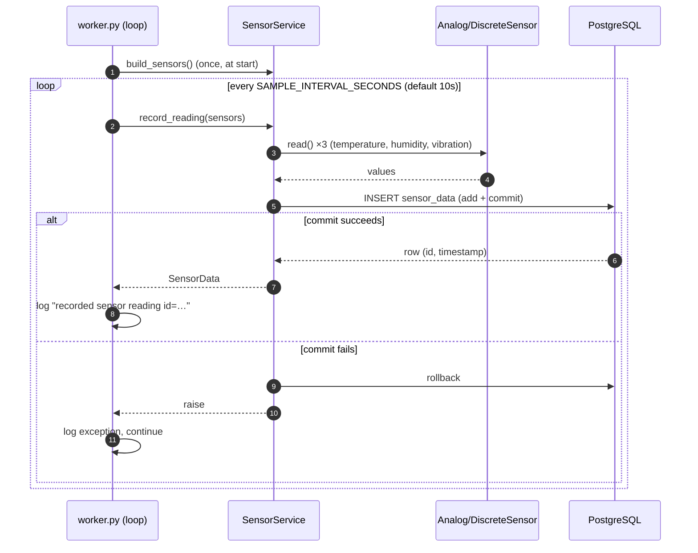
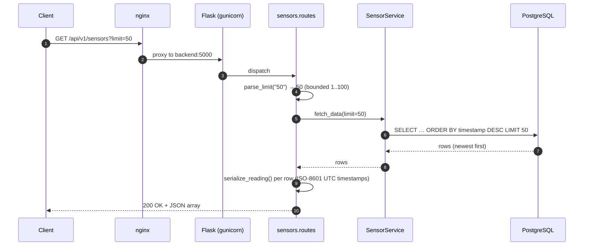
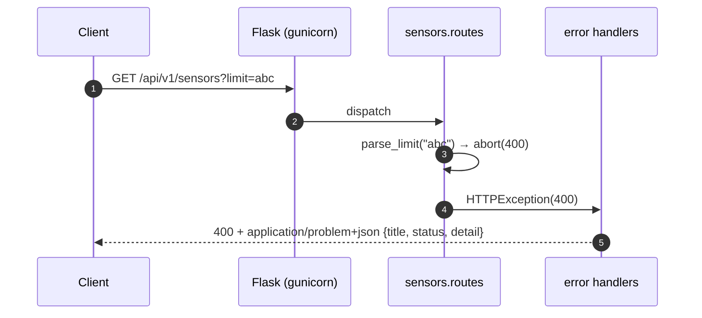
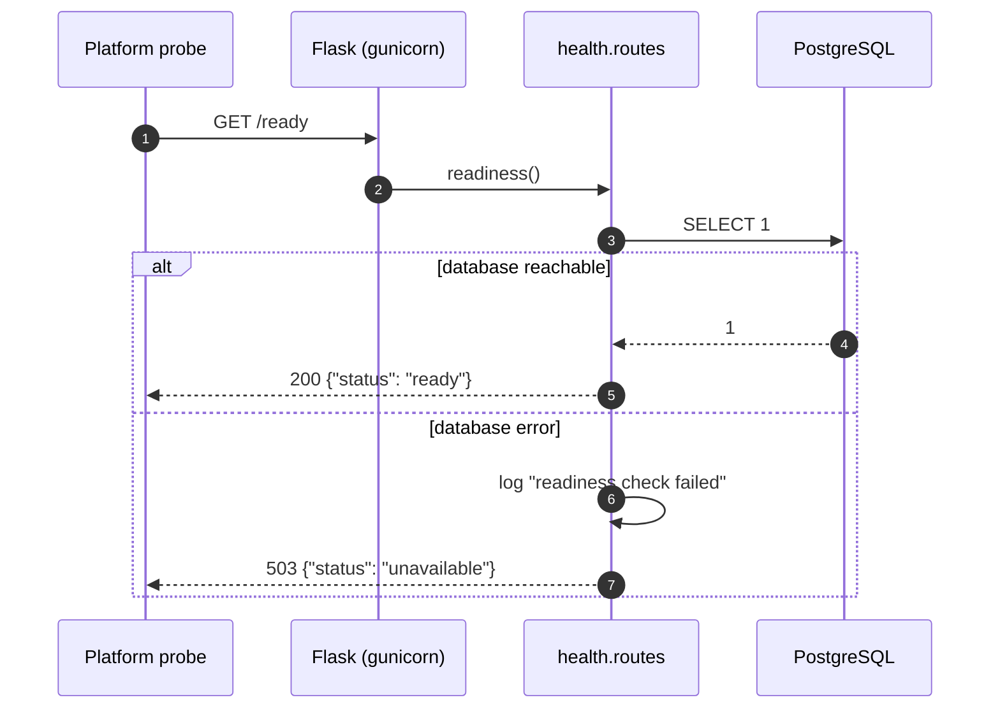

# 6. Runtime View

This chapter shows how the building blocks from
[Chapter 5](05-building-block-view.md) collaborate at runtime for the scenarios
that matter most: producing a reading, reading a snapshot, following the live
stream, rejecting bad input, and answering the readiness probe.

## 6.1 Generating a reading

The simulator worker owns a loop, separate from the web server. Once per
interval it samples the three sensors, builds a row, and commits it. A failed
commit is rolled back and logged, and the loop continues — one bad insert never
stops the generator.



The row's `timestamp` is set by the database default at insert time, so the
worker never has to supply it.

## 6.2 Reading a snapshot

A client asks for the most recent readings. The handler parses and bounds the
`?limit=`, the service runs one ordered, limited query, and each row is
serialized to JSON.



Without `?limit=`, the handler applies the default of 100.

## 6.3 Following the live stream

A browser opens the stream once and keeps it open. The server primes the client
with the latest reading, then repeatedly polls for rows newer than the last one
it sent, pushing each as an event. When there is nothing new, it sends a
keep-alive comment so the connection and any intermediaries stay warm.

```mermaid
sequenceDiagram
    autonumber
    participant B as Browser (EventSource)
    participant N as nginx (buffering off)
    participant F as Flask (gevent worker)
    participant EV as sensor_event_stream
    participant S as SensorService
    participant DB as PostgreSQL

    B->>N: GET /api/v1/sensors/stream
    N->>F: proxy (no buffering, long timeout)
    F->>EV: open stream (own app context)
    EV->>S: fetch latest reading
    S->>DB: SELECT … LIMIT 1
    DB-->>S: latest row
    EV-->>B: data: {…}  (prime); cursor = last_id
    loop every STREAM_POLL_SECONDS (2s)
        EV->>S: fetch_since(last_id)
        S->>DB: SELECT … WHERE id > last_id ORDER BY id ASC
        DB-->>S: new rows (or none)
        alt new rows
            EV-->>B: data: {…} per row; advance cursor
        else none
            EV-->>B: ": keep-alive" comment
        end
    end
```

The 2-second poll is well under the generator's 10-second interval, so a new
reading reaches the page within a couple of seconds of being recorded. The
browser prepends each event to the table, de-duplicating by `id` and capping the
visible rows.

## 6.4 Rejecting bad input

A malformed or out-of-range `?limit=` is rejected at the boundary before any
query runs. The handler raises, and the application's error handlers turn the
failure into one uniform JSON problem response.



The same boundary maps an unknown path to 404 and an unexpected failure to 500,
with the same problem shape — the client never sees a Werkzeug HTML page. The
mapping is detailed in [Chapter 8](08-crosscutting-concepts.md).

## 6.5 Readiness check

The platform's readiness probe reaches past liveness to the database: it runs a
trivial query and reports whether the instance can actually serve.



The shallow `GET /health` is simpler still: it returns `200 {"status": "ok"}`
whenever the process is alive, touching no dependencies. The two are used by
different probes for different questions — see
[Chapter 7](07-deployment-view.md) and [Chapter 8](08-crosscutting-concepts.md).
