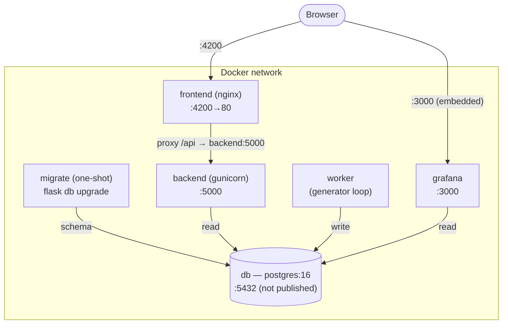
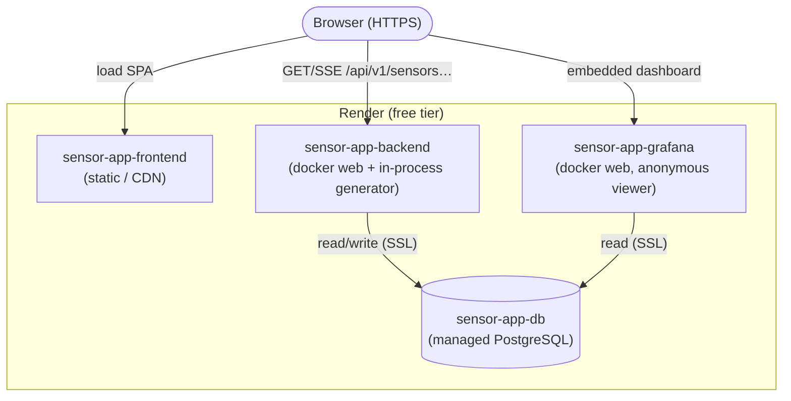
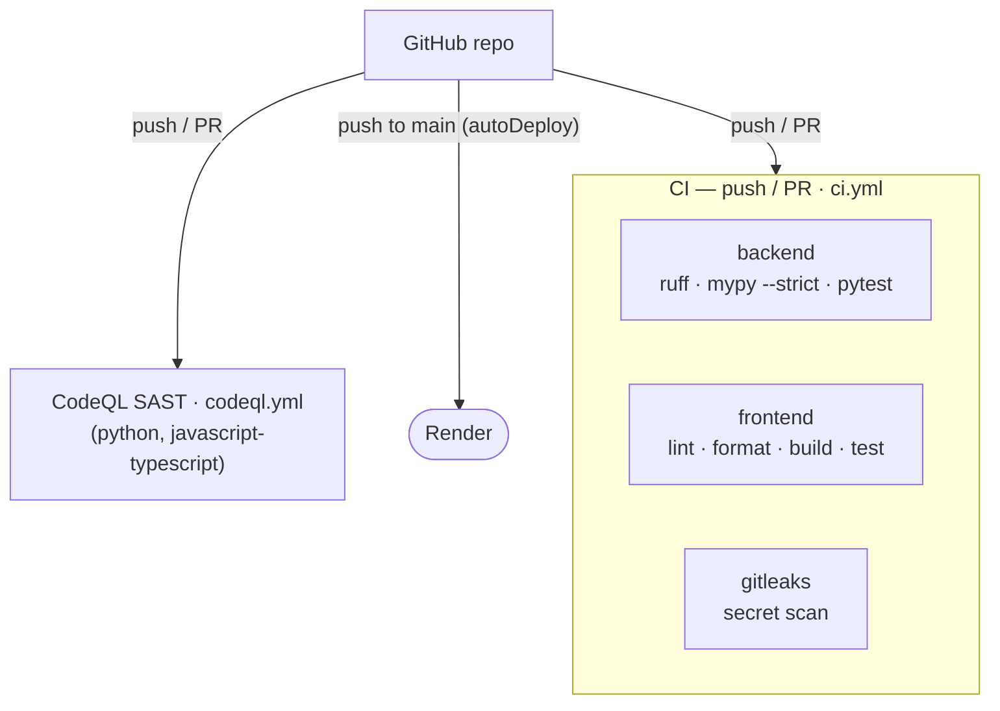

# 7. Deployment View

The system ships as one image per service ([Chapter 5](05-building-block-view.md)).
The same images run two ways: the full stack under local Docker Compose, and a
free-tier hosted deployment. Neither needs clustering to coordinate.

## 7.1 Environments

A change moves from a developer's machine, through the CI quality gate, to one
hosted target; there is no separate QA or staging tier.

| Environment | Host | Runs | Role |
| --- | --- | --- | --- |
| Local dev | Developer machine | The full `docker compose` stack, or a single service run directly | Inner development loop. |
| CI gate | GitHub Actions runners | backend checks (ruff, mypy `--strict`, pytest), frontend checks (lint, format, build, test), a secret scan, and CodeQL SAST | Enforces quality on each push and PR; required to merge into the protected `main`. Ephemeral, not a deployment. |
| Production | Render free tier | gunicorn (backend), a static CDN (frontend), Grafana, and a managed PostgreSQL | The live, public demo. |

Quality is enforced at the CI gate rather than in a deployed QA tier: a change
reaches production only after the checks pass as required status checks on
`main`. A standing QA environment would add release ceremony without catching
anything the gate does not, for a zero-cost demo.

## 7.2 Runtime topology — local (Docker Compose)

Locally the whole stack runs on one Docker network. A one-shot `migrate` service
applies the schema before the backend and worker start; the database port is not
published to the host. The browser reaches the frontend, which serves the SPA
and proxies `/api` to the backend; the worker and Grafana reach the database
directly.

Startup order is enforced by health conditions: `migrate` waits for the database
to be healthy; `backend`, `worker`, and `grafana` wait for `migrate` to complete
successfully; `frontend` waits for the backend to be healthy. Every service
declares a healthcheck and a restart policy. PostgreSQL and Grafana keep their
state in named volumes; the Grafana datasource and dashboards are mounted from
version-controlled provisioning files.

## 7.3 Runtime topology — hosted (Render free tier)

The hosted deployment is declared in [`render.yaml`](../../render.yaml): three
web services plus one managed database, all on the free plan. The frontend is a
static site on Render's CDN; the backend and Grafana are Docker web services;
PostgreSQL is managed. There is **no separate worker service** — on the free
tier the generator runs inside the backend process (see §7.5).

Because the static frontend is served from a different origin than the backend,
the frontend's API and Grafana URLs are absolute and baked into the bundle at
build time (§7.6), and the backend's `CORS_ORIGINS` is scoped to the frontend's
Render URL. The backend's `healthCheckPath` is `/health`; Grafana's is
`/api/health`.

## 7.4 CI/CD pipeline

Two workflows guard the repository. Every push or pull request runs the quality
gate ([`ci.yml`](../../.github/workflows/ci.yml)) and CodeQL static analysis
([`codeql.yml`](../../.github/workflows/codeql.yml)); both are required checks on
the protected `main`. Dependabot opens weekly update PRs for pip, npm, and
GitHub Actions.

Deployment is triggered by Render's `autoDeploy`: a push to `main` makes Render
rebuild and redeploy each service from source. An earlier spike evaluated
driving the deploy from CI via per-service deploy hooks and dropped it as
unnecessary at this size; a manifest-driven CI matrix is the design of record
should the fleet grow (ADR-0009, ADR-0010).

## 7.5 The generator: worker process vs. in-process

The generator is the same code in both environments, started two ways.

| Environment | How the generator runs |
| --- | --- |
| Local Compose | Its **own `worker` service** — a separate process running the loop, exactly as the architecture intends: no generator thread inside the web app. |
| Render free tier | **In-process**, as a daemon thread started once in a gunicorn worker via the `post_worker_init` hook, gated by `RUN_INPROCESS_GENERATOR=true`. The free tier runs no always-on worker service, so a single web instance (with `WEB_CONCURRENCY=1`) both serves requests and generates data. |

The in-process mode is a deliberate free-tier concession (ADR-0004), safe only
because there is exactly one worker; running it under multiple workers would
produce duplicate generators. On the free tier the schema is applied at startup
by [`render-start.sh`](../../backend/render-start.sh), which runs
`flask db upgrade` and then execs gunicorn.

## 7.6 Container images

| Service | Base image | Build | Process |
| --- | --- | --- | --- |
| backend | `python:3.12-slim` (pinned) | Multi-stage: deps built in a builder stage, then a slim runtime that runs as a non-root user | gunicorn serving `sensor_api:create_app()`, binding `$PORT`. |
| frontend | `node:22-alpine` → `nginx:1.27-alpine` (pinned) | Multi-stage: build the Angular bundle, copy it into nginx | nginx serves the static bundle and reverse-proxies `/api`. |
| grafana | `grafana/grafana:11.4.0` (pinned) | Bakes the provisioning files and a small entrypoint into the image | Grafana; the entrypoint maps `$PORT` and expands `DATABASE_URL` into the datasource. |

The frontend's API base URL is not hardcoded: a `prebuild` step
([`set-api-url.mjs`](../../frontend/scripts/set-api-url.mjs)) rewrites the
production environment from the `API_URL` / `GRAFANA_URL` build variables when
they are set, and otherwise keeps the committed same-origin defaults — which is
what local Compose relies on.

## 7.7 Scaling notes

The web tier is stateless: it holds no per-client state between requests, so it
scales by running more gunicorn workers or replicas. Two properties bound that,
and both trace back to the free-tier concession above:

- The **in-process generator** must run as exactly one instance. Scaling the web
  tier out means moving the generator back to its own dedicated worker service
  (as Compose already does) and turning `RUN_INPROCESS_GENERATOR` off.
- The **SSE stream** holds a long-lived connection per client; the cooperative
  `gevent` worker is what lets a single instance serve many streams at once.

> Operational note: free Render instances spin down after ~15 minutes of
> inactivity and cold-start (~30–60s) on the next request — expected for a
> zero-cost demo, and the dominant availability characteristic of the hosted
> deployment (see [Chapter 11](11-risks-and-technical-debt.md)).
